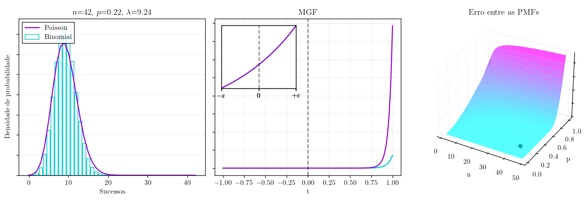

# Função Geradora de Momentos

Este projeto fornece uma visualização interativa para comparar a Função Geradora de Momentos (MGF) das distribuições Binomial e Poisson. Ele inclui um gráfico 3D da diferença entre as PMFs e um zoom na vizinhança de t=0 para melhor análise do comportamento da MGF.

## 📌 Funcionalidades

- **Visualização interativa** das PMFs da Binomial e Poisson
- **Gráfico da MGF** com um **zoom dinâmico** em t=0
- **Superfície 3D** mostrando a diferença entre as distribuições
- **Sliders interativos** para ajustar os parâmetros `n` e `p`

<div style="text-align: center;">
    
</div>


## 📖 Teoria por trás da convergência da MGF

A distribuição binomial $X \sim \text{Bin}(n, p)$ pode ser aproximada por uma distribuição de Poisson $Y \sim \text{Poisson}(\lambda)$, onde $\lambda = np$, quando $n$ é  grande e $p$ é pequeno. Essa aproximação é útil porque a distribuição de Poisson possui uma fórmula mais simples para cálculo das probabilidades.

A função de massa de probabilidade (PMF) da distribuição de Poisson é dada por:

$$
P(Y = x) = \frac{e^{-\lambda} \lambda^x}{x!}, \quad x = 0, 1, 2, \dots
$$

A convergência das distribuições pode ser analisada através das funções geradoras de momentos (MGFs). A MGF de uma variável aleatória $X$ é definida como:

$$
M_X(t) = E[e^{tX}]
$$

Para a distribuição Binomial, a MGF é dada por:

$$
M_X(t) = \left[ p e^t + (1 - p) \right]^n.
$$

Já para a distribuição de Poisson, a MGF é:

$$
M_Y(t) = e^{\lambda (e^t - 1)}.
$$

Substituindo $p = \frac{\lambda}{n}$ e tomando o limite quando $n \to \infty$, temos:

$$
M_X(t) \to M_Y(t).
$$

Isso mostra que a MGF da Binomial converge para a MGF da Poisson, justificando a aproximação.

## 📦 Estrutura do Projeto

```
converging-mgf/
│── config.py        # Configurações globais do projeto
│── funcoes.py       # Funções auxiliares para cálculos estatísticos
│── main.py          # Arquivo principal que executa a visualização
│── plotting.py      # Funções para geração de gráficos
│── sliders.py       # Implementação dos sliders interativos
│── README.md        # Documentação do projeto
│── requirements.txt # Pacotes necessários para instalação
```

## 🚀 Instalação

1. **Clone o repositório**
   ```sh
   git clone https://github.com/GGregon/visualizations.git
   cd visualizations/mgf-convergence
   ```
2. **Crie e ative um ambiente virtual (opcional, mas recomendado)**
   ```sh
   python -m venv venv  # Criação do ambiente virtual
   source venv/bin/activate  # No Linux/macOS
   venv\Scripts\activate  # No Windows
   ```
3. **Instale as dependências**
   ```sh
   pip install -r requirements.txt
   ```

## ▶️ Como Executar

Execute o script principal:

```sh
python main.py
```

Isso abrirá a interface interativa para explorar as diferenças entre as distribuições.

## 📌 Exemplo de Uso

Você pode alterar os valores de `n` e `p` com os sliders e observar como as distribuições Binomial e Poisson se comportam conforme esses parâmetros variam.

## 🛠️ Dependências

O projeto requer as seguintes bibliotecas Python:

```sh
matplotlib
numpy
scipy
```

Caso precise instalá-las manualmente, use:

```sh
pip install matplotlib numpy scipy
```

